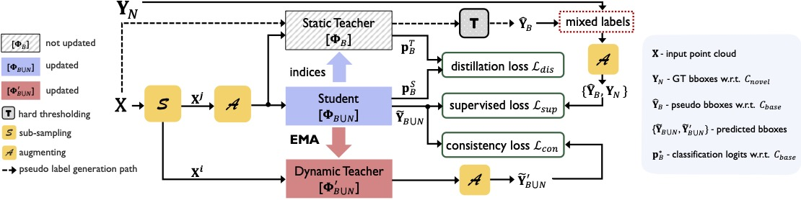

# Static-Dynamic Co-Teaching for Class-Incremental 3D Object Detection 

Created by <a href="https://github.com/Na-Z" target="_blank">Na Zhao</a> from 
<a href="http://www.nus.edu.sg/" target="_blank">National University of Singapore</a>



## Introduction
This repository is about the PyTorch implementation for our AAAI 2022 Paper 
"[Static-Dynamic Co-Teaching for Class-Incremental 3D Object Detection](https://arxiv.org/pdf/2112.07241.pdf)" by Na Zhao and Gim Hee Lee. 

Deep learning-based approaches have shown remarkable performance in the 3D object detection task. However, they suffer from a catastrophic performance drop on the originally trained classes when incrementally learning new classes without revisiting the old data. This "catastrophic forgetting" phenomenon impedes the deployment of 3D object detection approaches in real-world scenarios, where continuous learning systems are needed. In this paper, we study the unexplored yet important class-incremental 3D object detection problem and present the first solution - SDCoT, a novel static-dynamic co-teaching method. Our SDCoT alleviates the catastrophic forgetting of old classes via a static teacher, which provides pseudo annotations for old classes in the new samples and regularizes the current model by extracting previous knowledge with a distillation loss. At the same time, SDCoT consistently learns the underlying knowledge from new data via a dynamic teacher. We conduct extensive experiments on two benchmark datasets and demonstrate the superior performance of our SDCoT over baseline approaches in several incremental learning scenarios.


## Setup
- Install `python` --This repo is tested with `python 3.6.8`.
- Install `pytorch` with CUDA -- This repo is tested with `torch 1.1`, `CUDA 9.0`. 
It may wrk with newer versions, but that is not gauranteed.
- Install Tensorboard -- This repo is tested with `tensorboard 1.14.0`.
- Compile the CUDA layers for PointNet++, which is used in the backbone network:
    ```
    cd pointnet2
    python setup.py install
    ```
- Install dependencies
    ```
    pip install -r requirements.txt
    ```
    
    

## Usage
### Data preparation
For SUNRGB-D, follow the [README](https://github.com/Na-Z/SDCoT/blob/main/sunrgbd/README.md) under `sunrgbd` folder.

For ScanNet, follow the [README](https://github.com/Na-Z/SDCoT/blob/main/scannet/README.md) under `scannet` folder.

### Running
For SUNRGB-D, you can modify line 40-46 in ./cfg/sunrgbd_cfg.py to set up the class splitting (splitting of base and novel classes), then use the following command to train and evaluate:

- Training
    - Base training:
        ```
        CUDA_VISIBLE_DEVICES=0 python main/train_bt.py --method basetrain --dataset sunrgbd --num_point 20000 --pc_augm
        ```
    - Baseline methods (set $FT_LAYERS='last' for "Freeze and add" and set $FT_LAYERS='all' for "Fune-tuning"):
        ```
        CUDA_VISIBLE_DEVICES=0 python main/train_ft.py --method finetune --dataset sunrgbd --num_point 20000 --model_checkpoint_path $MODEL_CHCECKPOINT_PATH --n_novel_class $N_NOVEL_CLASS --ft_layers $FT_LAYERS --lr $FT_LR --n_epochs 100 --pc_augm
        ```
    - Our method (SDCoT):
        ```
        CUDA_VISIBLE_DEVICES=0 python main/train_sdcot.py --method SDCoT --dataset sunrgbd --num_point 20000 --model_checkpoint_path $MODEL_CHCECKPOINT_PATH --n_novel_class $N_NOVEL_CLASS --pc_augm
       ```

- Testing:
    ```
    CUDA_VISIBLE_DEVICES=0 python main/eval.py --phase test --method $METHOD --dataset sunrgbd --num_point 20000 --model_checkpoint_path $MODEL_CHCECKPOINT_PATH --n_novel_class $N_NOVEL_CLASS --cluster_sampling vote_fps --use_3d_nms --use_cls_nms --per_class_proposal
    ```   


For ScanNet, you can modify line 47-53 in ./cfg/scannet_cfg.py to set up the class splitting (splitting of base and novel classes), then use the following command to train and evaluate:

- Training
    - Base training:
        ```
        CUDA_VISIBLE_DEVICES=0 python main/train_bt.py --method basetrain --dataset scannet --num_point 40000 --pc_augm
        ```
    - Baseline methods (set $FT_LAYERS='last' for "Freeze and add" and set $FT_LAYERS='all' for "Fune-tuning"):
        ```
        CUDA_VISIBLE_DEVICES=0 python main/train_ft.py --method finetune --dataset scannet --num_point 40000 --model_checkpoint_path $MODEL_CHCECKPOINT_PATH --n_novel_class $N_NOVEL_CLASS --ft_layers $FT_LAYERS --lr $FT_LR --n_epochs 100 --pc_augm
        ```
    - Our method (SDCoT):
        ```
        CUDA_VISIBLE_DEVICES=0 python main/train_sdcot.py --method SDCoT --dataset scannet --num_point 40000 --model_checkpoint_path $MODEL_CHCECKPOINT_PATH --n_novel_class $N_NOVEL_CLASS --pc_augm
       ```

- Testing:
    ```
    CUDA_VISIBLE_DEVICES=0 python main/eval.py --phase test --method $METHOD --dataset scannet --num_point 40000 --model_checkpoint_path $MODEL_CHCECKPOINT_PATH --n_novel_class $N_NOVEL_CLASS --cluster_sampling vote_fps --use_3d_nms --use_cls_nms --per_class_proposal
    ```   

Note: You can use `CUDA_VISIBLE_DEVICES=0,1,2` to specify which GPU(s) to use. Without specifying CUDA devices, the training will use all the available GPUs and train with data parallel (Note that due to I/O load, training speedup is not linear to the nubmer of GPUs used). 
Run `python main/*.py -h` to see more argument options. While training you can check the log file on its progress, or use the TensorBoard to see loss curves.
      

## Acknowledgement
Our implementation leverages on the source code from the following repositories:
- [Deep Hough Voting for 3D Object Detection in Point Clouds](https://github.com/facebookresearch/votenet)
- [Pointnet2/Pointnet++ PyTorch](https://github.com/erikwijmans/Pointnet2_PyTorch)
- [SESS: Self-Ensembling Semi-Supervised 3D Object Detection](https://github.com/Na-Z/sess)
